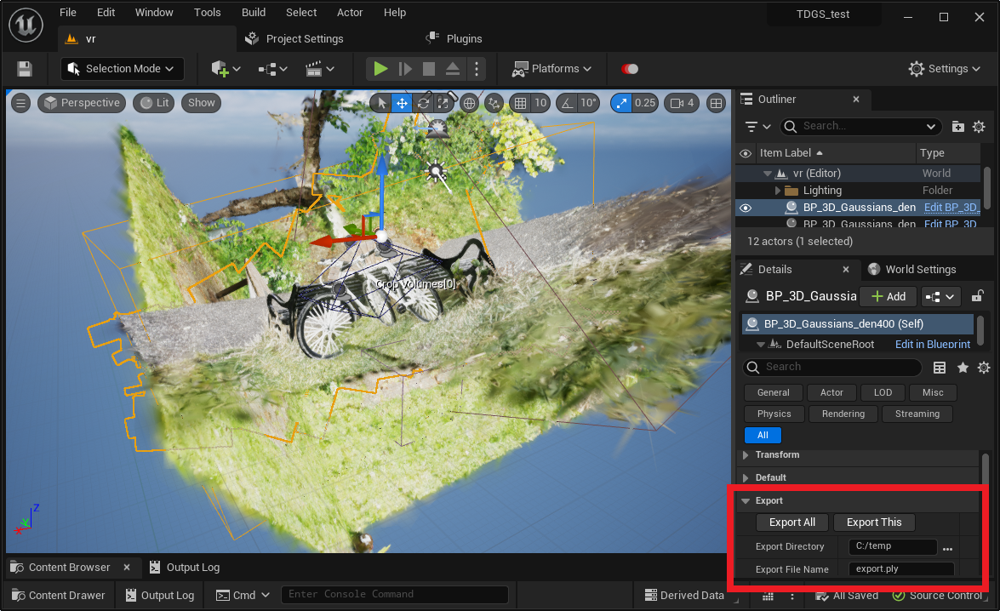

# Merge and export

You can merge multiple models and exported them to a single .ply file with cropping, etc. applied.  
This is useful for

- Reduce file size by deleting unnecessary parts
- Create a scene that combines multiple models

{ loading=lazy }  

1. Select "BP_3D_Gaussians_ModelName" placed in the level and specify the export destination in "Export" on the details tab.

	- **Export Directory**: Specify the destination directory to export
	- **Export File Name**: Specify the .ply file name to export

2. Press the button below to execute the export of the .ply file

	- **Export All**: Exports all 3D Gaussians actors on the level into one merged .ply file
	- **Export This**: Exports selected 3D Gaussians actors to a .ply file

	In both of the above cases, the export will be executed with the following applied:

	- Actor Transform
	- Enabled Block
	- Crop Volume, Kill Volume
