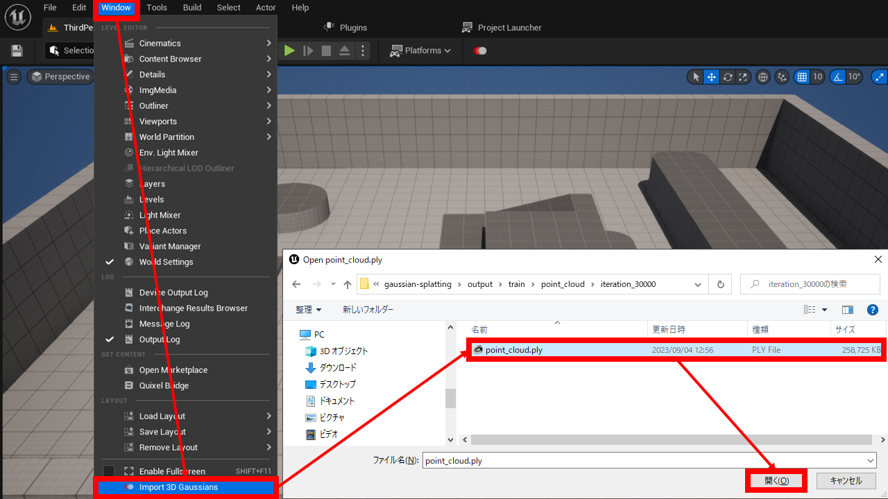
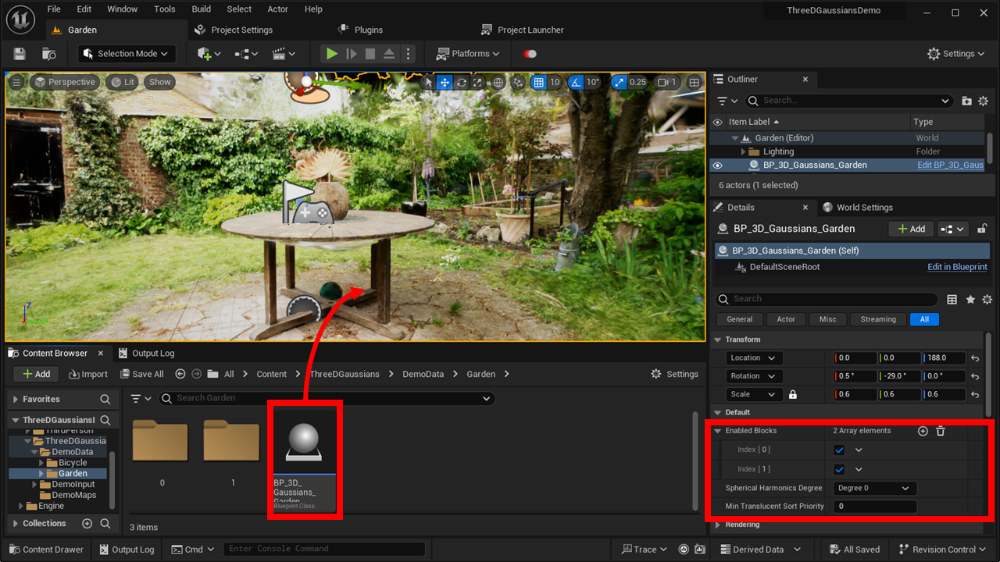

# Import and place to level

## Import

{ loading=lazy }  

1. Select `Window > Import 3D Gaussians` from the menu at the top of the UE editor
2. In the dialog window, select `point_cloud.ply`, the result of 3D Gaussian Splatting training

!!! Failure "The path must contain alphanumeric characters only"
	You cannot import from a path that contains multibyte characters such as Japanese.  
	The path must contain only alphanumeric characters.

!!! Failure "Folder structure rule"
	Folder structure must be "*ModelName* > point_cloud > iteration_*nnnnn*"

## Place to level

{ loading=lazy }  

1. Drag and drop "Content > ThreeDGaussians > *ModelName* > BP_3D_Gaussians_*ModelName*" onto the level in the content browser.

Also, if necessary, set the following items under "Default" in the Details tab.

- **Enabled Blocks**: Select which blocks of imported data will be displayed.
- **Spherical Harmonics Degree**: Select the color rendering method.  
	"Degree 0" disables the color change depending on the angle of view (no reflections, etc.).  
	"Degrees 1-3" enable the color change with viewing angle. A higher Degree makes the rendering more accurate, but increases the rendering load.  
- **Albedo Tint**: Correct color. The color specified here will be multiplied by the original color.
- **Crop Volumes**: Add elements and specify the cropping range.  
	Gaussians outside the range specified here will not be rendered.
- **Kill Volumes**: Add elements and specify hidden ranges.  
	Gaussians inside the range specified here will not be rendered.
- **Min translucent sort priority**: Sets the priority for rendering 3D Gaussian Splatting data.  
	In this plug-in, 3D Gaussian Splatting data is drawn as a translucent mesh.  
	This value is applied to the `Translucency Sort Priority` of the furthest block, and a value of (this value + number of valid blocks - 1) is applied to the nearest block.
	
!!! Warning "Migrate cropping range from v1.2 or earlier"
	"Crop Volume", which was used in v1.2 and earlier, has been deprecated. It may be removed in the future.  
	Please disable "Crop" under DEPRECATED and use the new "Crop Volumes".

### Known issues

!!! Failure "Known issue with Lit mode"
	1. If the point light is close to the surface of the 3D Gaussian Splatting data, the brightness may be uneven.  
		Below, there is a moment when the light on the right suddenly becomes brighter.  
		{ loading=lazy }  
	2. The brightness of spot lights and rect lights is not evaluated correctly, making them darker than directional lights and point lights.  
		All three lights below have an intensity of 15 cd, but you can see that the spot light in the front and the rect light on the right are darker than the spotlight on the left.  
		{ loading=lazy }  