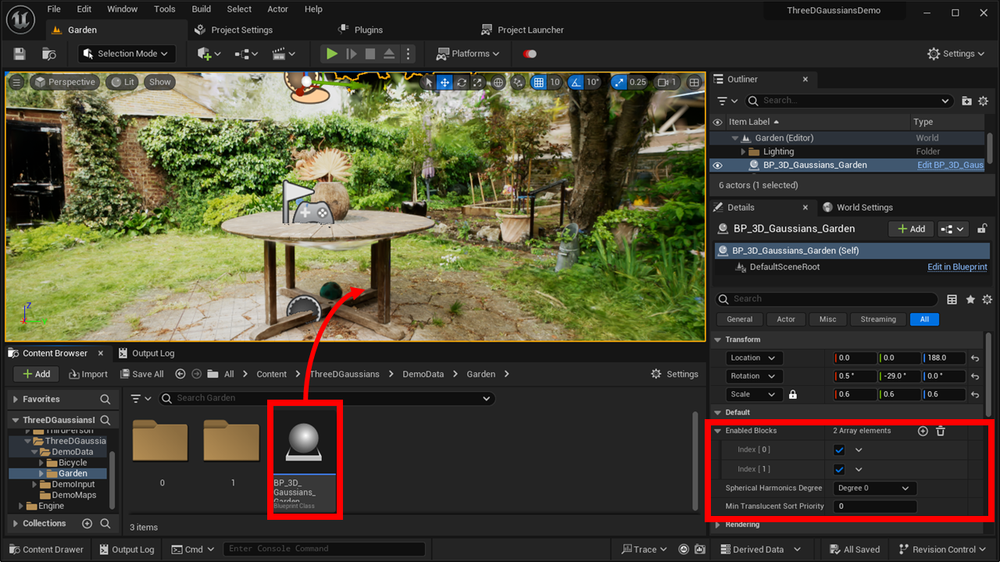

# Import and place to level

## Import

{ loading=lazy }  

1. Select `Window > Import 3D Gaussians` from the menu at the top of the UE editor
2. In the dialog window, select `point_cloud.ply`, the result of 3D Gaussian Splatting training

!!! Failure "The path must contain alphanumeric characters only"
	You cannot import from a path that contains multibyte characters such as Japanese.  
	The path must contain only alphanumeric characters.

## Place to level

{ loading=lazy }  

1. Drag and drop "Content > ThreeDGaussians > *ModelName* > BP_3D_Gaussians_*ModelName*" onto the level in the content browser.

Also, if necessary, set the following items under "Default" in the Details tab.

- **Enabled Blocks**: Select which blocks of imported data will be displayed.
- **Spherical Harmonics Degree**: Select the color rendering method.  
	"Degree 0" disables the color change depending on the angle of view (no reflections, etc.).  
	"Degrees 1-3" enable the color change with viewing angle. A higher Degree makes the rendering more accurate, but increases the rendering load.  
- **Albedo Tint**: Correct color. The color specified here will be multiplied by the original color.
- **Min translucent sort priority**: Sets the priority for rendering 3D Gaussian Splatting data.  
	In this plug-in, 3D Gaussian Splatting data is drawn as a translucent mesh.  
	This value is applied to the `Translucency Sort Priority` of the furthest block, and a value of (this value + number of valid blocks - 1) is applied to the nearest block.
- **Crop Volumes**: Add elements and specify the cropping range.  
	Gaussians outside the range specified here will not be rendered.
- **Kill Volumes**: Add elements and specify hidden ranges.  
	Gaussians inside the range specified here will not be rendered.
- **Sprite Size**: Adjust the size of the sprite that draws the Gaussian distribution.  
	Increasing this value allows accurate rendering to the edges of the Gaussian distribution. However, this increases the number of overlapping sprites and increases the drawing load.  

- **Render Mode**: Set the rendering method.
	- **Translucent, Unlit**: The default rendering method. Produces the closest result to standard 3D Gaussian Splatting.
	- **Translucent, Unlit, 2DGS**: Renders 3D Gaussians as 2D Gaussians, ignoring the shortest axis. This reduces rendering load but lowers quality. It improves compatibility with other engine rendering pipelines and works in many cases, including SceneCapture2D.
	- **Translucent, Lit**: Same as the default method, but affected by lights.
	- **Translucent, Lit, 2DGS**: Renders as 2D Gaussians with reduced load, affected by lights.
	- **Masked, Unlit**: Same as default method, but drawn as Masked material. This enables expressions that Translucent cannot achieve, such as correct rendering of the front-back relationship between multiple objects. However, it generates dither-based noise.
	- **Masked, Lit**: Same as "Masked, Unlit", but affected by lights. It can also receive shadows from other objects.
	- **Masked, Lit, Cast Shadow**: Same as "Masked, Lit", but can cast shadows. This is the most computationally expensive.
	- **Custom**: Customize render method
		- **Primitive type**: Default 3D Gaussian or 2D Gaussian (lower performance and quality).
		- **Blend mode**: Translucent material or Masked material.
		- **Shading model**: Unlit or Lit.
		- **Mesh type**: The method used to create the internal mesh for 3DGS drawing. Static Mesh can be used for Masked materials, improving performance and visual quality. For Translucent materials, Niagara Mesh Renderer is automatically selected internally.
		- **Cast shadow**: Whether to cast shadows.

- **Alpha Boost For 2D Gaussians**: Adjust the opacity of the gaussinas in the "2D Gaussians" rendering method.
	The opacity in the "2D Gaussians" rendering method tends to be thin, so tweak this for your liking.
- **Specular**: Sets the strength of Specular in the case of a Masked material.
- **World Normal**: Sets the Normal in world coordinates in the case of a Masked material.
- **Shadow Intensity**: Adjusts the intensity of shadows when casting shadows.

!!! Warning "Flickering when viewed from a long distance"
	By default, the Gaussian sort order is calculated with 16-bit precision, which can cause flickering when viewed from a long distance, as the sort order cannot be correctly evaluated at a distance.

	In UE 5.2 and above, setting ‘Project Settings > Plugins > Niagara > Renderer > Default Sort Precision’ to ‘High’ solves the problem in many cases.

### Known issues

!!! Failure "Known issues with VR"
	In UE5.1, if the HMD Roll is not 0 (head tilted to the left or right), rendering will not be correct. Please use UE5.2 or higher.

!!! Failure "Known issues with portrait aspect ratio"
	UE5.1 may not render correctly if the screen aspect ratio is portrait. Use UE5.2 or above.
