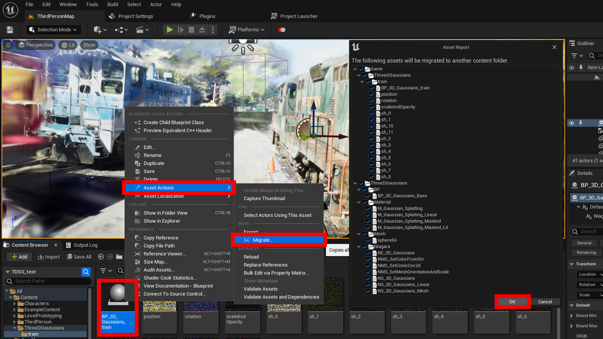

# Migrate to BP projets

The C++ module included in this plug-in is only used for the import process.  
Therefore, imported data can be migrated to a BP project that does not contain C++.

{ loading=lazy }  

1. Right-click "BP_3D_Gaussians_*ModelName*" under "Content > ThreeDGaussians > *ModelName*" in the content browser
2. Select "Asset Actions > Migrate..." and click "OK" in the dialog box
3. Select the content folder of the BP project to be migrated