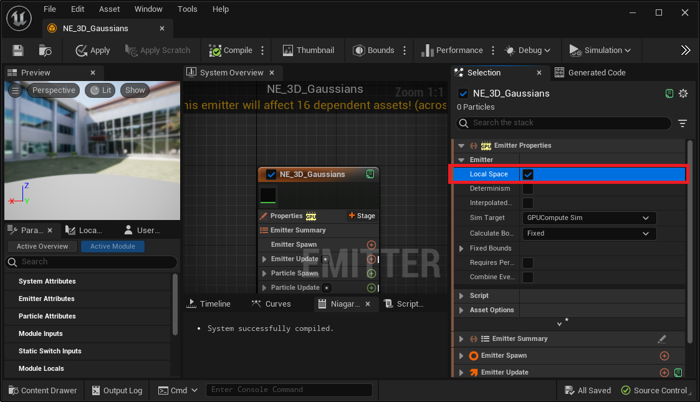

# Customize rendering

## Render in local space

{ loading=lazy }  

Open "Engine > Plugins > 3D Gaussians Content > Niagara > NE_3D_Gaussians" and enable "Local Space" of Emitter Properties to process Niagara particle in local space.  
If you want to move 3D Gaussians Splatting actors at runtime using Sequencer etc., please turn on "Local Space".

## Use your own Niagara

By specifying any Niagara System to the variable "Default > Advanced > Niagara Override" of "BP_3D_Gaussians_ModelName", you can use that Niagara for the rendering.  
The main way to use it is:

1. Copy the Niagara System from "Engine > Plugins > 3D Gaussians Content > Niagara"
2. Add some modules to it
3. Specify it tp the "Niagara Override"

### Example: Move by Wind Force

{ loading=lazy }  

By specifying "Engine > Plugins > 3D Gaussians Content > Example > NS_3D_Gaussians_sh0_MoveByWindForce" to "Niagara Override", you can get the effect above.

### Example: Rotate by Curl Noise

{ loading=lazy }  

By specifying "Engine > Plugins > 3D Gaussians Content > Example > NS_3D_Gaussians_sh0_RotateByCurlNoise" to "Niagara Override", you can get the effect above.

### Example: Scale by Curl Noise

{ loading=lazy }  

By specifying "Engine > Plugins > 3D Gaussians Content > Example > NS_3D_Gaussians_sh0_ScaleByCurlNoise" to "Niagara Override", you can get the effect above.
