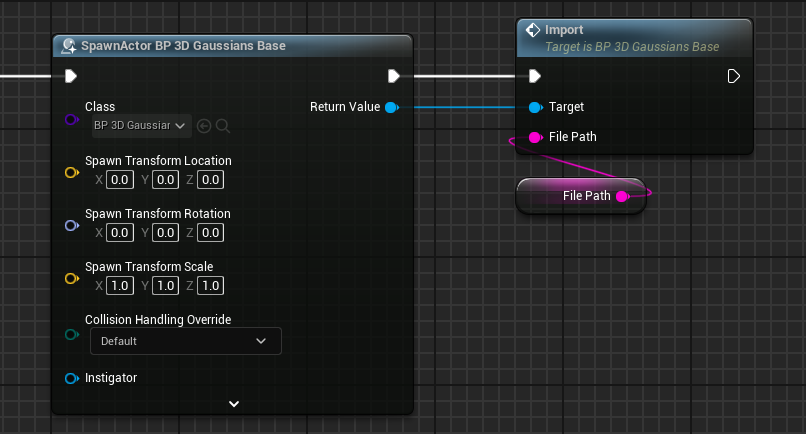

# Runtime load

You can load ply file at runtime.

{ loading=lazy }  

## How to Runtime-load

1. Spawn `BP_3D_Gaussians_Base`
2. Specify the full path of the ply file you want to load and call `Import`.

{ loading=lazy }  

## Demo project

UE Project files and EXE file are available at [GitHub](https://github.com/Akiya-Research-Institute/3dGaussiansPlugin-RuntimeLoadDemo).