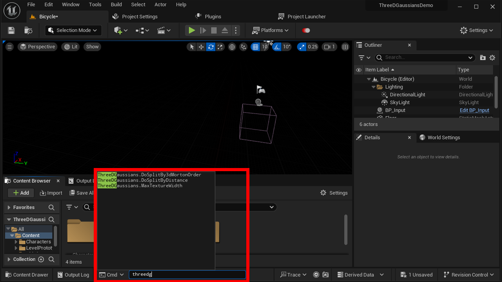

# Adjust block split rule

This plugin renders 3D Gaussian Splatting data using Niagara particles. Because there is a limit to the number of particles in a Niagara system, this plugin imports 3D Gaussian Splatting data into multiple blocks.  

This allows for large data sizes to be rendered, but it does cause a problem: if you look carefully, you can see the seams between the blocks.  
For this reason, the block split rules can be edited according to the intended use.  
The data is re-split by changing the rules in the following procedure and importing the data again.

{ loading=lazy }  

## Specify block size

In this plugin, the 3D Gaussian Splatting data after splitting is stored in square textures.  
The maximum value of the texture's sides can be set by specifying the console variable like `ThreeDGaussians.MaxTextureWidth 1264`.  

The square of this value is the maximum number of particles each block can hold.  
The default value is 1024.

!!! Question "The max number of particles in Niagara"
    The maximum number of particles Niagara can handle is 2,000,000. (as of UE5.1).  
    However, although the detailed conditions are unknown, sometimes a warning message appears with a smaller value (e.g., 1,597,823 particles).  
    Therefore, the default split size is set to 1024*1024=1,048,576.  

## Select split mode

### Split by Morton Order

This method is enabled by default.  

```
Split data into two blocks by the position of Z-axis  
→ For each split block, split data into two blocks by the position of Y-axis.  
→ For each split block, split data into two blocks by the position of X-axis.  
→ For each split block, split data into two blocks by the position of Z-axis.  
→ ...  
(Loop until the size of the block becomes smaller then the max size specified above.)  
```

This method has the advantage that it is easy to sort the depth of each block viewed from the camera.  
On the other hand, it has the disadvantage that it is difficult to predict where the seams between the blocks will appear.

!!! Question "Runtime depth-sort for each block"
    A binary tree is used to the depth-sort of each block.  
    This binary tree is constructed during the splitting and stored in `TArray<FThreeDGaussiansTree> tree`.  
    This `tree` is an element of `FThreeDGaussians` which is passed from C++ importer to a subclass of `BP_3D_Gaussians_Base` which is used at runtime.  
    Depth-sort by the binary `tree` is implemented in the `Tick` event of `BP_3D_Gaussians_Base`.

### Split by the distance

```
Make a block from the first N data closest to the origin  
→ Make a block from the next N data closest to the origin  
→ ...  
(Loop until all data are grouped)
```

This method has the advantage that seams between the blocks do not appear near the origin.  
However, this method has the disadvantage that although it can draw correctly when viewed from the block closest to the origin, it cannot draw correctly when viewed from the block outside of it.  
(This is because the drawing order of translucency can only be specified on a block-by-block basis.)  

Therefore, use this method for the scenes where the user moves only within the block closest to the origin.  

This method can be enabled by specifying the following two in the console variable:  

- `ThreeDGaussians.DoSplitBy3dMortonOrder 0`
- `ThreeDGaussians.DoSplitByDistance 1`

## Tips

??? success "Keep data as small as possible"

    You can reduce the number of splits by keeping the data small in the first place.  
    You can reduce the data size in exchange for image quality by specifying like `--densification_interval 500` in the options of `train.py`` of 3D Gaussian Splatting.  

    Note that reducing the data size also improves the FPS.