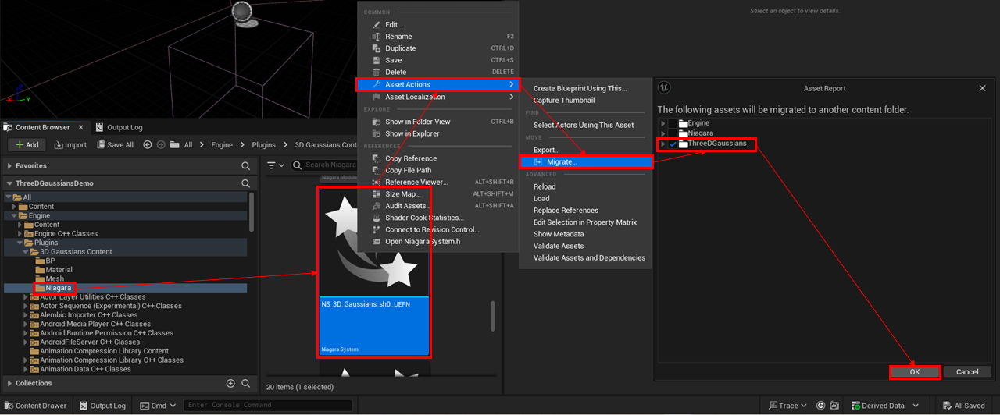
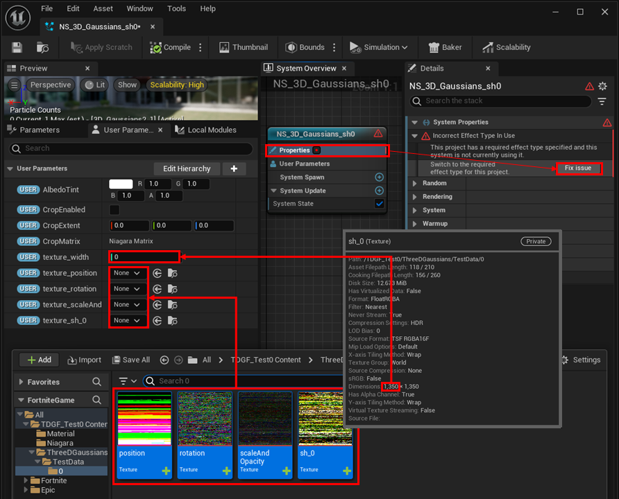

# Migration to UEFN (Experimental)

Since BP is not available in UEFN, we have the following restrictions

- Manual setup of texture data in Niagara System is required.
- Control of the rendering order between divided blocks is not supported.

Currently, only Fortnite for Windows PC has been tested.

## Operation in the UE project

{ loading=lazy }  

1. Right-click "Engine > Plugins > 3D Gaussians Content > Niagara > NS_3D_Gaussians_sh0_UEFN" in the content browser.
2. Select "Asset Actions > Migrate...", check "ThreeDGaussians" in the dialog box, and click OK. 
3. Select the contents folder of the destination UEFN project to migrate.
4. Import a model to a UE project as described in "[Import](../how-to-import/#import)" section, and migrate "position", "rotation", "scaleAndOpacity" and "sh_0" in "Content > ThreeDGaussians > Model Name > Block Number" to the destination UEFN project.

## Operation in the UEFN project

{ loading=lazy }  

1. Open "Content > Niagara > NS_3D_Gaussians_sh0_UEFN" in the content browser
2. In the User Parameters tab, set "position", "rotation", "scaleAndOpacity" and "sh_0" in "Content > ThreeDGaussians > Model Name > Block Number" to "texutre_position", "texutre_rotation", "texutre_scaleAndOpacity" and "texutre_sh_0. Also, set the width of the texture to "texutre_width".
3. Select the "NS_3D_Gaussians_sh0_UEFN" system's properties and click "Fix issues".

	{ loading=lazy }  

4. Drag and drop "Engine > Plugins > 3D Gaussians Content > Niagara > NS_3D_Gaussians_sh0_UEFN" from the content browser onto the level.
5. In the Scalability settings, set "Epic" for Effects.

!!! Warning "How to crop in UEFN"

	You can specify crop translation, rotation, and extent in UEFN.  
	The problem is it is really difficult to find proper values for these variables in UEFN.  
	It is recommended to find these vaules in UE and copy-paste them into UEFN.  
