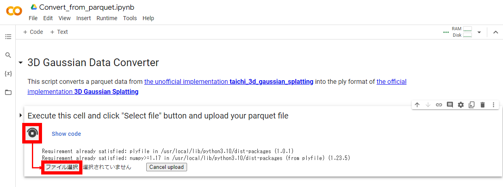
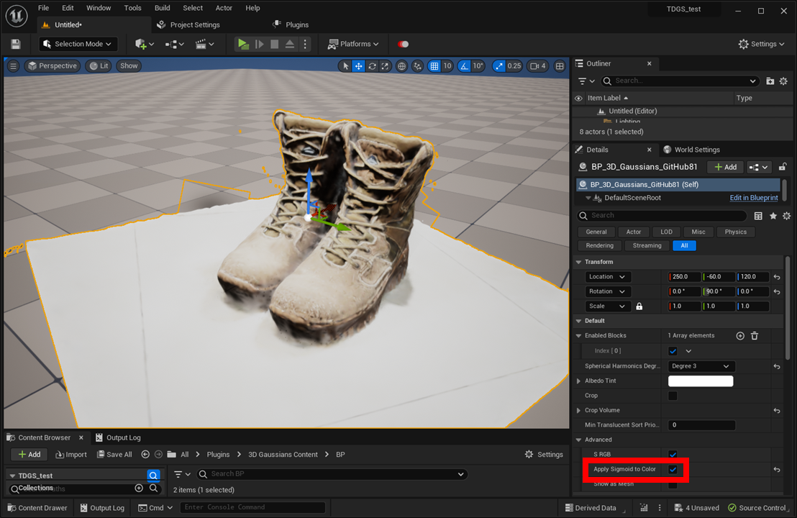

# Convert from unofficial implementation (Experimental)

The official implementation of 3D Gaussian Splatting is not available for commercial use, but there is unofficial implementations released under licenses that allow commercial use.  
By converting the format of models generated by the unofficial implementation, they can be used in this plug-in.

## Convert from [taichi_3d_gaussian_splatting](https://github.com/wanmeihuali/taichi_3d_gaussian_splatting)

{ loading=lazy }  

1. Open [conversion script](https://colab.research.google.com/drive/1agmqiuLH9W9PkG6zG8VVgVySBiJ-vxXA?usp=sharing).
2. Press the Execute button, then press the Select File button to upload the parquet file.
3. Conversion will begin automatically and the ply file will be downloaded when completed.

    { loading=lazy }  

4. Import a model to a UE project as described in "[Import](../how-to-import/#import)" section
5. Enable "Default > Advanced > Apply Sigmoid to Color" in the Details panel of the model BP.

!!! Tip "Convert in local"

	To run the conversion script in your local machine, follow the steps below. This is useful when the file size is large.

	1. Install the following package in your Python environment
		```
		pip install pandas, numpy, plyfile
		```
	1. Click "Show code" in the code block of the conversion script, copy lines 15-48 to a local text file and name it convert.py
	1. Add a line to the top of the convert.py and save
		```
		path = '/path/to/your/file.parquet'
		```	
	1. Execute convert.py
		```
		python convert.py
		```	