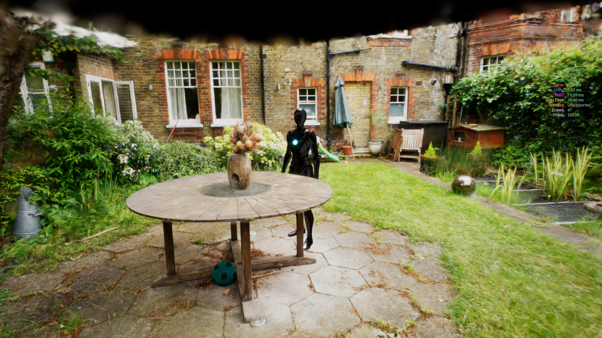

# サンプルシーンのデモ

{ loading=lazy }  

## ダウンロード

EXE形式のデモプロジェクトを[こちら](https://taguchishouji-my.sharepoint.com/:u:/g/personal/kasa_taguchishouji_onmicrosoft_com/ESL5tSLg-cpNomZDj_lMgfsBpT_VaZunWSAZQhp3WsZb2w?e=YhyPwf)からダウンロードできます。

## システム要件

- Windows 10 64bit
- DirectX 12対応のGPU

## デモの操作

デモには、Mip-NeRF 360のデータを使った「Garden」と「Bicycle」のシーンが含まれています。

- 移動：WASDキー + マウス
- マップ切り替え：Tabキー
- FPS表示：Fキー
- 終了: ESCキー

## GitHubソース

デモのUE5プロジェクトファイルを[GitHubで公開](https://github.com/Akiya-Research-Institute/3dGaussiansPlugin-Demo)しています。
