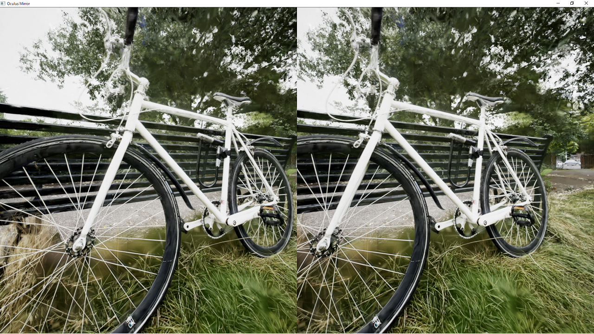

# VRのデモ

{ loading=lazy }  

## ダウンロード

EXE形式のデモプロジェクトを[こちら](https://taguchishouji-my.sharepoint.com/:u:/g/personal/kasa_taguchishouji_onmicrosoft_com/EcY_VMXLGcNHllLGnENVAokB6GJ-OK8v-Bdpc-e6-54M6Q?e=wm7mYE)からダウンロードできます。

## システム要件

- Windows 10 64bit
- DirectX 12対応のGPU

## デモの操作

デモには、Mip-NeRF 360のデータを使った「Bicycle」のシーンが含まれています。

- テレポート移動：右スティック
- スナップターン：左スティック
- 終了: Bボタンメニューから選択
