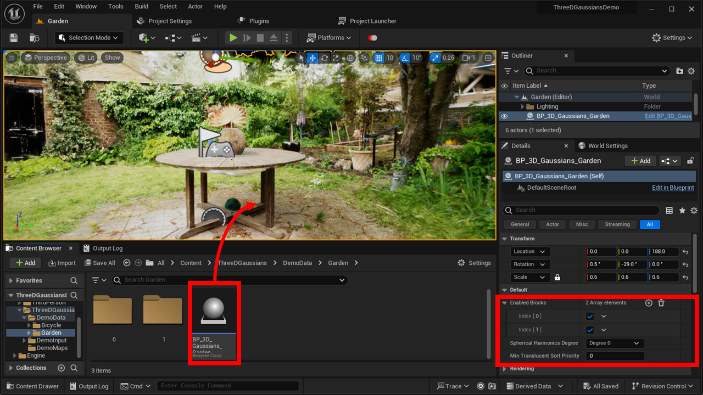
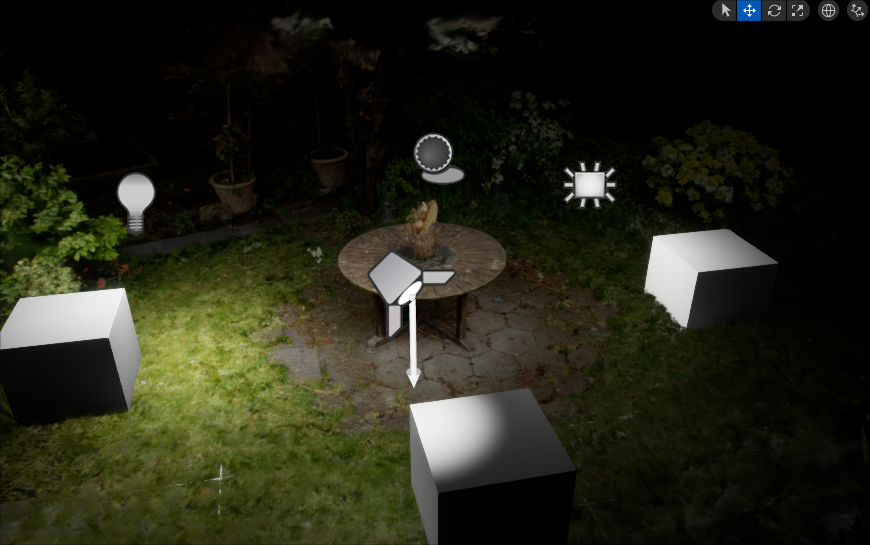

# インポートとレベルへの配置

## インポート

{ loading=lazy }  

1. UEエディタ上部のメニューで「Window > Import 3D Gaussians」を選択します
2. ダイアログ画面で、3D Gaussian Splattingの学習結果の「point_cloud.ply」を選択します。

!!! Failure "パスは英数字のみ"
	日本語などマルチバイト文字が含まれるパスからはインポートできません。  
	パスには英数字のみが含まれるようにしてください。

!!! Failure "フォルダ構造の制約"
	フォルダ構造は「モデル名 > point_cloud > iteration_n」となっている必要があります。

## レベルへの配置

{ loading=lazy }  

1. コンテンツブラウザで「Content > ThreeDGaussians > モデル名」の下の「BP_3D_Gaussians_モデル名」をレベル上にドラッグ＆ドロップします。

また、必要に応じて詳細タブの「Default」の下の項目を設定します。

- **Enabled Blocks**で、インポートしたデータのどのブロックを表示するかを選択します。
- **Spherical Harmonics Degree**で、色の描画方法を選択します。  
	「Degree 0」は見る角度による色の変化を無効にします（反射などがなくなります）。  
	「Degree 1～3」は見る角度による色の変化を有効にします。高いDegreeを指定すると描画が正確になりますが、描画負荷が上がります。
- **Albedo Tint**で、色を補正します。ここで指定した色が元の色に乗算されます。  
- **Min translucent sort priority**で、3D Gaussian Splattingのデータの描画の優先度を設定します。  
	本プラグインでは、3D Gaussian Splattingのデータは半透明のメッシュとして描画されます。  
	最も遠いブロックのTranslucency Sort Priorityにこの値が適用され、最も近いブロックには`この値 + 有効なブロック数 - 1`の値が適用されます。
- **Crop Volumes**に要素を追加し、トリミング範囲を指定します。ここで指定した範囲の外は描画されなくなります。  
- **Kill Volumes**に要素を追加し、非表示の範囲を指定します。ここで指定した範囲の中は描画されなくなります。  
- **Sprite Size**でガウス分布を描画するスプライトのサイズを調整します。  
	この値を大きくするとガウス分布の端まで正しく描画されるようになり描画精度が向上します。ただし、それだけスプライトの重なりが多くなり描画負荷が増大します。  
- **Advanced > VR**で、VR対応をオンにするかを設定します。VR対応にすると描画負荷が少し増加します。  
- **Advanced > Lit**で、光を受けるかを設定します。  
	オンにするとLit・Translucentなマテリアルとして、オフにするとUnlit・Translucentなマテリアルとして描画されます。  

!!! Warning "v1.2以前からのトリミング範囲の移行"
	v1.2以前で使用されていたCrop Volumeは非推奨となりました。将来的に削除される可能性があります。  
	DEPRECATEDの下の"Crop"を無効にし、新しいCrop Volumesをご使用ください。

!!! Warning "現在、VRはSpherical Harmonics Degree 0のみに対応"
	現状、Degree1～3を選択しても、VRをオンにするとDegree 0として描画されます。  
	Degree1～3には順次対応予定です。

### 既知の問題

!!! Failure "Lit表示の既知の問題"
	1. ポイントライトが3D Gaussian Splattingのデータの表面に近い場合、不均一な明るさとなる場合があります。  
		下記では右側のライトが手前で突然明るくなる瞬間があります。  
		{ loading=lazy }  
	2. スポットライト、矩形ライトの明るさが正しく評価されず、ディレクショナルライトやポイントライトより暗くなります。  
		下記の3つのライトはいずれもIntensityが15cdですが、手前のスポットライトと右側の矩形ライトが左側のスポットライトに比べて暗いことがわかります。  
		{ loading=lazy }  