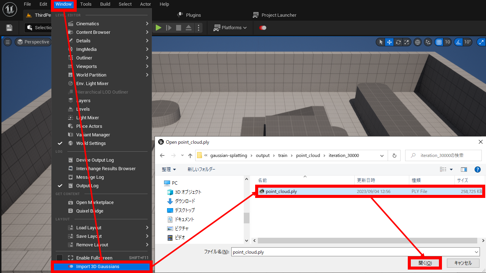

# インポートとレベルへの配置

## インポート

{ loading=lazy }  

1. UEエディタ上部のメニューで「Window > Import 3D Gaussians」を選択します
2. ダイアログ画面で、3D Gaussian Splattingの学習結果の「point_cloud.ply」を選択します。

!!! Failure "パスは英数字のみ"
	日本語などマルチバイト文字が含まれるパスからはインポートできません。  
	パスには英数字のみが含まれるようにしてください。

## レベルへの配置

{ loading=lazy }  

1. コンテンツブラウザで「Content > ThreeDGaussians > モデル名」の下の「BP_3D_Gaussians_モデル名」をレベル上にドラッグ＆ドロップします。

また、必要に応じて詳細タブの「Default」の下の項目を設定します。

- **Enabled Blocks**で、インポートしたデータのどのブロックを表示するかを選択します。
- **Spherical Harmonics Degree**で、色の描画方法を選択します。  
	「Degree 0」は見る角度による色の変化を無効にします（反射などがなくなります）。  
	「Degree 1～3」は見る角度による色の変化を有効にします。高いDegreeを指定すると描画が正確になりますが、描画負荷が上がります。
- **Albedo Tint**で、色を補正します。ここで指定した色が元の色に乗算されます。  
- **Min translucent sort priority**で、3D Gaussian Splattingのデータの描画の優先度を設定します。  
	本プラグインでは、3D Gaussian Splattingのデータは半透明のメッシュとして描画されます。  
	最も遠いブロックのTranslucency Sort Priorityにこの値が適用され、最も近いブロックには`この値 + 有効なブロック数 - 1`の値が適用されます。
- **Crop Volumes**に要素を追加し、トリミング範囲を指定します。ここで指定した範囲の外は描画されなくなります。  
- **Kill Volumes**に要素を追加し、非表示の範囲を指定します。ここで指定した範囲の中は描画されなくなります。  
- **Sprite Size**でガウス分布を描画するスプライトのサイズを調整します。  
	この値を大きくするとガウス分布の端まで正しく描画されるようになり描画精度が向上します。ただし、それだけスプライトの重なりが多くなり描画負荷が増大します。  

- **Render Mode**で、描画方式を設定します。
	- **Translucent, Unlit**: デフォルトの描画方式です。通常の3D Gaussian Splattingに最も近い描画結果になります。
	- **Translucent, Unlit, 2DGS**: 3D Gaussianの最も短い軸を無視して2D Gaussianとして描画します。描画負荷が軽減されますが、品質は低下します。エンジンの他の描画パイプラインとの互換性が高くなり、SceneCapture2Dを含む多くの場合で機能します。
	- **Translucent, Lit**: デフォルトの描画方式と同様ですが、ライトの影響を受けます。
	- **Translucent, Lit, 2DGS**: 2D Gaussianとして描画し、描画負荷が軽減されます。ライトの影響を受けます。
	- **Masked, Unlit**: デフォルトの方式で別途描画した結果をMaskedマテリアルとして描画します。複数オブジェクトの前後関係が正しく描画されるなど、Translucentではできない表現が可能です。ただし、ディザによるノイズが発生します。
	- **Masked, Lit**: "Masked, Unlit"と同様の描画方式ですが、ライトの影響を受けます。また、他のオブジェクトの影を受けることができます。
	- **Masked, Lit, Cast Shadow**: "Masked, Lit"と同様の描画方式ですが、影を落とすことができます。最も描画負荷が高くなります。
	- **Custom**: 下位の項目（Primitive type, Blend mode, Shading model, Mesh type, Cast shadow）を編集することで、上記以外の描画方式が実現できます。
		- **Primitive type**: デフォルトの3D Gaussianとして描画するか、描画負荷と品質の低い2D Gaussianとして描画するか。
		- **Blend mode**: Translucentマテリアルか、Maskedマテリアルか。
		- **Shading model**: Unlitか、Litか。
		- **Mesh type**: 3DGS描画のために内部で使用するメッシュの作り方。Maskedマテリアルの場合はStatic Meshを使うことができ、パフォーマンスと描画品質が向上します。Translucentマテリアルの場合は、Niagara Mesh Rendererが内部で自動的に選択されます。
		- **Cast shadow**: 影を落とすか。

- **Alpha Boost For 2D Gaussians**で、「2DGS」描画方式におけるガウシアンの透明度を調整します。  
	「2DGS」描画方式では透明度が薄くなりがちなので、この値を好みに合わせて調整してください。
- **Specular**: Maskedマテリアルの場合のSpecularの強さを設定します。
- **World Normal**: Maskedマテリアルの場合のNormalをワールド座標で設定します。
- **Shadow Intensity**: 影を落とす場合の影の濃さを調整します。

!!! Warning "描画範囲の広いデータでチラつきが発生する場合"
	デフォルトではガウシアンのソート順を16bitの精度で計算しており、遠方ではソート順を正しく評価できなくなるため、広範囲のデータではチラつきが発生します。

	UE5.2以上で、「Project Settings > Plugins > Niagara > Renderer > Default Sort Precision」を「High」にすると多くの場合は問題が解決します。

### 既知の問題

!!! Failure "VRでの既知の問題"
	UE5.1では、HMDのRollが0以外（首を左右に傾けた状態）では正常に描画されません。UE5.2以上を使用してください。

!!! Failure "縦長画面での問題"
	UE5.1では、画面のアスペクト比が縦長だと正常に描画できない場合があります。UE5.2以上を使用してください。
