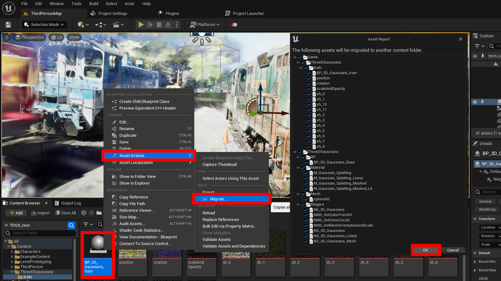

# BPプロジェクトへの移行

本プラグインに含まれるC++モジュールはインポート処理にのみ使われます。  
そのため、インポート済みのデータは、C++を含まないBPプロジェクトに移行することができます。

{ loading=lazy }  

1. コンテンツブラウザで「Content > ThreeDGaussians > モデル名」の下の「BP_3D_Gaussians_モデル名」を右クリックします。
2. 「Asset Actions > Migrate...」を選択し、表示されたダイアログでOKをクリックします。
3. 移行先のBPプロジェクトのコンテンツフォルダを選択します。
