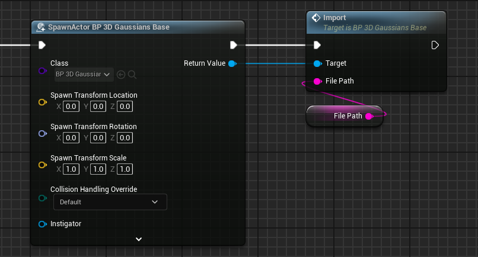

# ランタイムロード

ゲームの実行時にplyデータを読み込むことができます。

{ loading=lazy }  

## ランタイムロードの実行方法

1. BP_3D_Gaussians_Base をスポーンします。
2. 読み込みたいplyファイルのフルパスを指定し、Importを呼び出します。

{ loading=lazy }  

## ランタイムロードのデモ

プロジェクトファイルとEXEファイルを[GitHub](https://github.com/Akiya-Research-Institute/3dGaussiansPlugin-RuntimeLoadDemo)で公開しています。