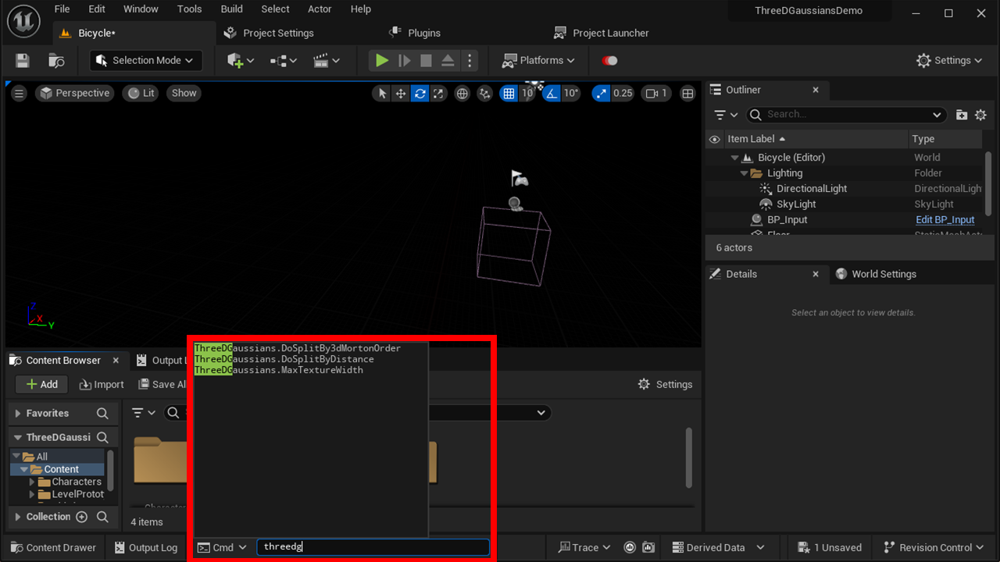
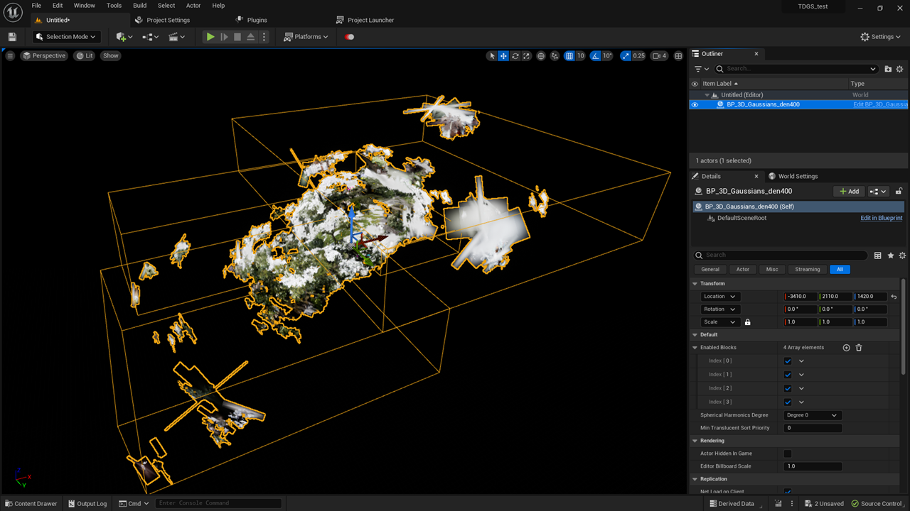
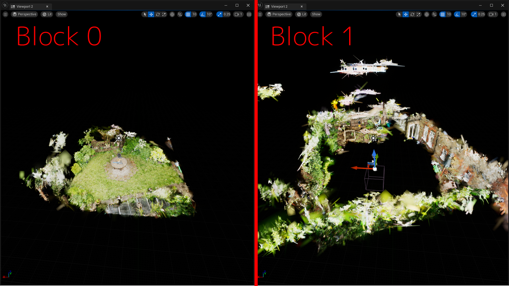

# ブロックの分割の調整

{ loading=lazy }  

本プラグインは、Niagaraのパーティクルを使用して3D Gaussian Splattingのデータを描画します。  
一つのNiagaraシステムが保持できるパーティクル数には上限があるため、このプラグインは必要に応じてデータを複数のブロックに分けてインポートし、複数のNiagaraシステムにそれらを割り振ります。  

これによりデータサイズが大きくても描画が可能ですが、注意深く見るとブロック間の継ぎ目が見えてしまうという問題があります。  
そのため、用途に応じてブロックの分割ルールを変更できるようになっています。  
下記の方法で分割ルールを変更し、再度データをインポートすることでデータが再分割されます。

## 分割の最大サイズの指定

本プラグインでは、分割後の3D Gaussian Splattingのデータは正方形のテクスチャに保存されます。  
テクスチャの辺の最大値を、コンソール変数で`ThreeDGaussians.MaxTextureWidth 1264`のように指定することで設定できます。  

この値の2乗が、各ブロックで保持する最大パーティクル数となります。  
デフォルトは1024です。

!!! Question "Niagaraで扱える最大パーティクル数"
    Niagaraで扱える最大パーティクル数は、2,000,000個です。（UE5.1時点）  
    ただし、詳細な条件は不明ですが、それより小さな値で警告が出ることがあります(1,597,823個など)。  
    そのため、このプラグインでは、デフォルトの分割サイズを1024*1024=1,048,576としています。  

## 分割方式の選択

### Morton Orderでの分割

{ loading=lazy }  

デフォルトで有効となっている分割方式です。  

```
Z軸の位置でデータを2分割  
→ 分割された各ブロックについて、Y軸の位置でデータを2分割  
→ 分割された各ブロックについて、X軸の位置でデータを2分割  
→ 分割された各ブロックについて、Z軸の位置でデータを2分割  
→ ...  
```

と繰り返して、上記で指定した分割の最大サイズに収まるようにデータを分割する方式です。  
この方式は、分割後の各ブロックについてカメラから見たときの前後関係が容易に判定可能であるという利点があります。  
一方で、分割の境界線がどこに発生するかを予想しにくいという欠点があります。

この方式は、コンソール変数で下記を指定することで再度有効化できます。  

- `ThreeDGaussians.DoSplitBy3dMortonOrder 1`

!!! Question "実行時の各ブロックの前後関係判定処理"
    この方式では、各ブロックの前後関係判定処理に2分木を使用します。  
    この2分木は分割時に構築し、これを`TArray<FThreeDGaussiansTree> tree`に格納しています。  
    この`tree`は`FThreeDGaussians`の要素としてC++のインポータから実行時に使われる`BP_3D_Gaussians_Base`のサブクラスに渡されます。  
    `BP_3D_Gaussians_Base`の`Tick`の中に`Tree`を使った前後関係判定処理が実装されています。

### 原点からの距離での分割

{ loading=lazy }  

```
原点に最も近いn個のデータを最初のブロックとする  
→ その次に原点に近いn個のデータを次のブロックとする  
→ ...  
```

と繰り返す分割方式です。  
この方式は、原点付近にブロック間の境界が発生しないという利点があります。  
ただし、この方式は、原点に最も近いブロックから見ると正しく描画できますが、その外のブロックから中央の方向を見ると正しく描画できないという欠点があります。  
（半透明の描画順序をブロック単位でしか指定できないため）

そのため、この方式は、ユーザが原点に最も近いブロックの中でのみ移動するシーンに適用してください。

この方式は、コンソール変数で下記の二つを指定することで有効化できます。  

- `ThreeDGaussians.DoSplitBy3dMortonOrder 0`
- `ThreeDGaussians.DoSplitByDistance 1`

## Tips

!!! success "できるだけ分割を避ける"

    そもそものデータを小さくしておくことで分割数を減らすことができます。  
    3D Gaussian Splattingの train.py のオプションで`--densification_interval 500`などを指定すると、ある程度の画質と引き換えにデータサイズを減らすことができます。