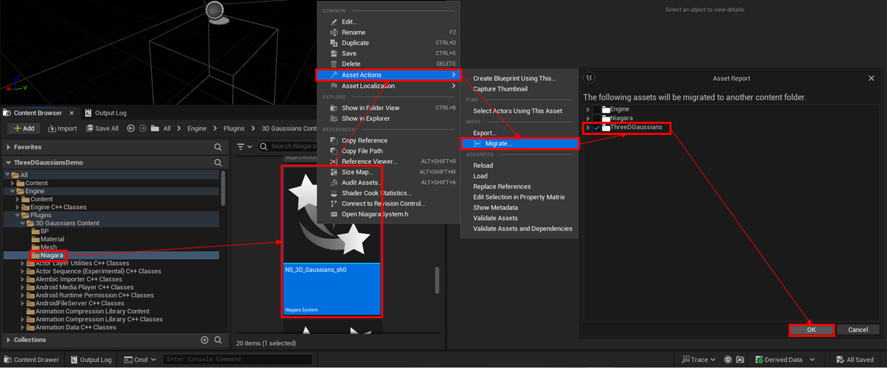
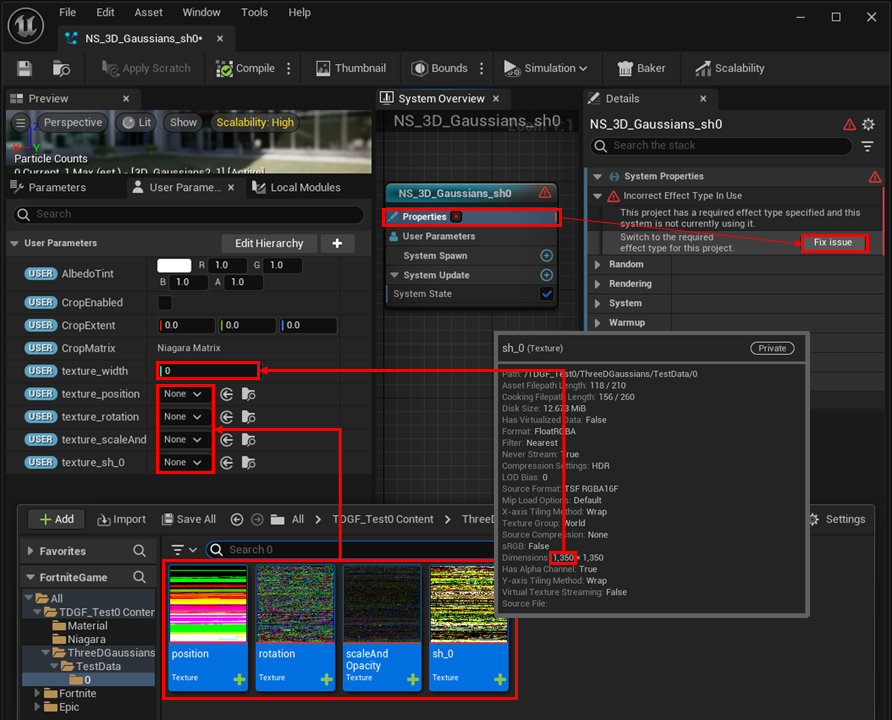
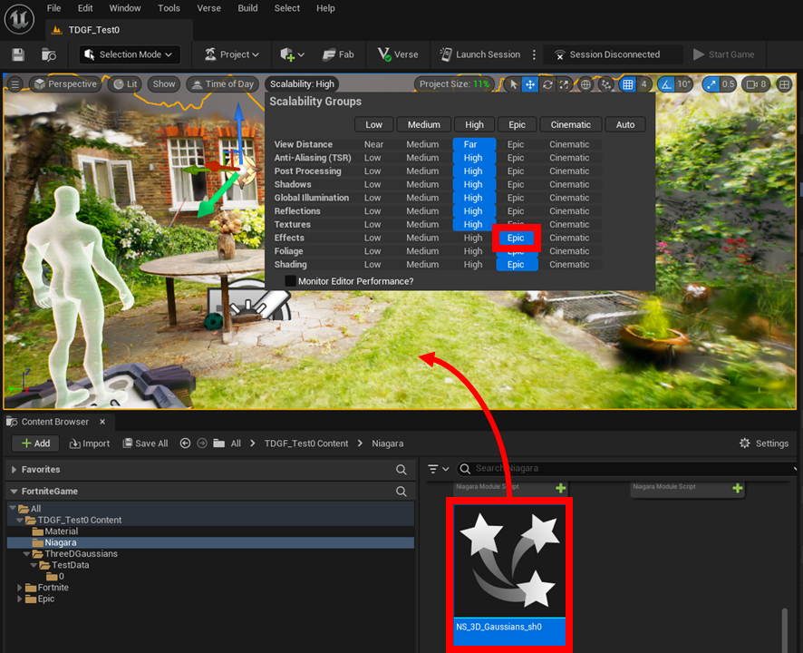

# UEFNへの移行(実験的)

UEFNではBPが使用できないため、下記の制約があります。

- 手動でNiagara Systemにテクスチャデータを設定する必要があります。
- 分割されたブロック間の描画順の制御に対応していません。

現状、Windows PC版のFortniteでのみ動作確認済みです。

## UEプロジェクトでの操作

{ loading=lazy }  

1. コンテンツブラウザで「Engine > Plugins > 3D Gaussians Content > Niagara > NS_3D_Gaussians_sh0」を右クリックします。
2. 「Asset Actions > Migrate...」を選択し、表示されたダイアログで「ThreeDGaussians」にチェックを付けて、OKをクリックします。
3. 移行先のUEFNプロジェクトのコンテンツフォルダを選択し、移行します。
4. 「[インポート](../how-to-import/#_2)」の通りにモデルをインポートし、「Content > ThreeDGaussians > モデル名 > ブロック番号」の下の「position」「rotation」「scaleAndOpacity」「sh_0」についても、移行先のUEFNプロジェクトに移行します。

## UEFNプロジェクトでの操作

{ loading=lazy }  

1. コンテンツブラウザで「Content > Niagara > NS_3D_Gaussians_sh0」を開きます。
2. ユーザパラメータタブで「texutre_position」「texutre_rotation」「texutre_scaleAndOpacity」「texutre_sh_0」に、「Content > ThreeDGaussians > モデル名 > ブロック番号」の下の「position」「rotation」「scaleAndOpacity」「sh_0」を指定します。また、「texutre_width」に「position」のテクスチャの横幅を指定します。
3. 「NS_3D_Gaussians_sh0」システムのプロパティを選択し、「Fix issues」をクリックします。

	{ loading=lazy }  

4. コンテンツブラウザから「Engine > Plugins > 3D Gaussians Content > Niagara > NS_3D_Gaussians_sh0」をレベル上にドラッグアンドドロップします。
5. Scalability設定で、Effectsを「Epic」に設定します。

!!! Warning "UEFNでのトリミング"
	
	UEFN上でトリミング範囲（位置、回転、大きさ）を指定することができます。  
	ただし、これらの適切な値をUEFN上で設定するのはとても難しいです。  
	UE上でこれらの適切な値を見つけて、UEFNにコピーペーストすることをお勧めします。  
	なお、回転はクォータニオンで表されることに注意してください。