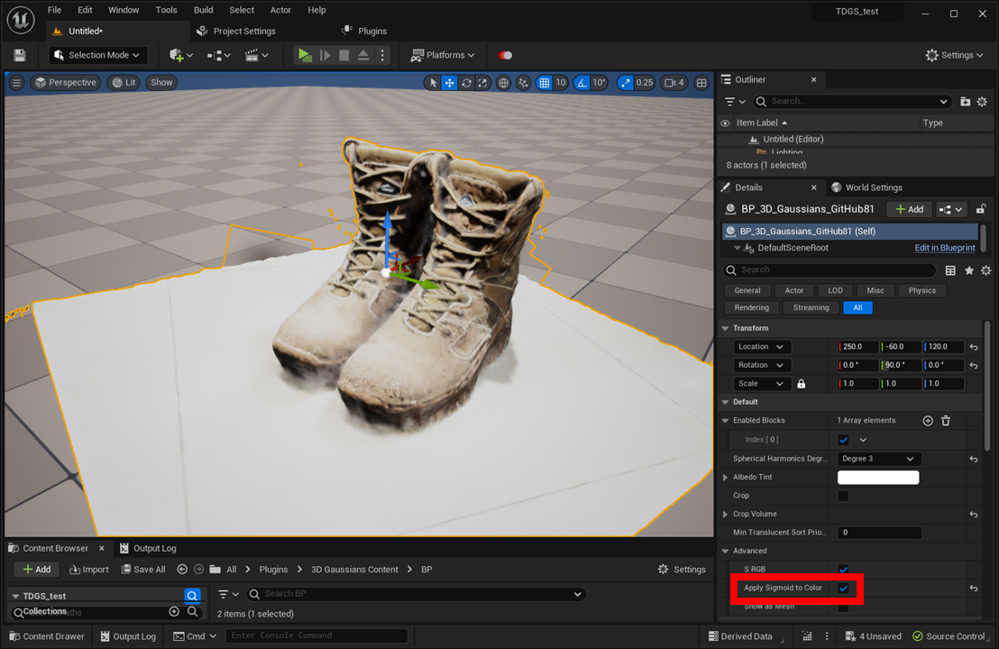

# 非公式実装から変換(実験的)

3D Gaussian Splattingの公式実装は商用利用不可ですが、商用利用可能なライセンスで公開されている非公式実装があります。  
非公式実装で生成したモデルのフォーマットを変換することで、このプラグインで使用できるようになります。

## [taichi_3d_gaussian_splatting](https://github.com/wanmeihuali/taichi_3d_gaussian_splatting)からの変換

{ loading=lazy }  

1. [変換用スクリプト](https://colab.research.google.com/drive/1agmqiuLH9W9PkG6zG8VVgVySBiJ-vxXA?usp=sharing)を開きます。
2. スクリプトの実行ボタンを押し、ファイル選択ボタンを押して学習結果のparquetファイルをアップロードします。
3. 自動的に変換が始まり、完了するとplyファイルがダウンロードされます。
4. 「[インポート](../how-to-import/#_2)」の通りにplyモデルをインポートします。

    { loading=lazy }  

5. モデルBPのDetailsパネルで「Default > Advanced > Apply Sigmoid to Color」を有効にします。

!!! Tip "ローカル環境での変換"

	変換用スクリプトをローカル環境で実行するには下記の手順を実行します。これはファイルサイズが大きい場合に特に有効です。

	1. Python環境で下記のパッケージをインストールします。
		```
		pip install pandas, numpy, plyfile
		```
	1. 変換用スクリプトのコードブロックでShow codeをクリックし、15～48行目をローカルのテキストファイルにコピーし、名前をconvert.pyとします。
	1. convert.pyファイルの先頭に対象ファイルのパスを追記します。
		```
		path = '/path/to/your/file.parquet'
		```	
	1. convert.pyを実行します。
		```
		python convert.py
		```	